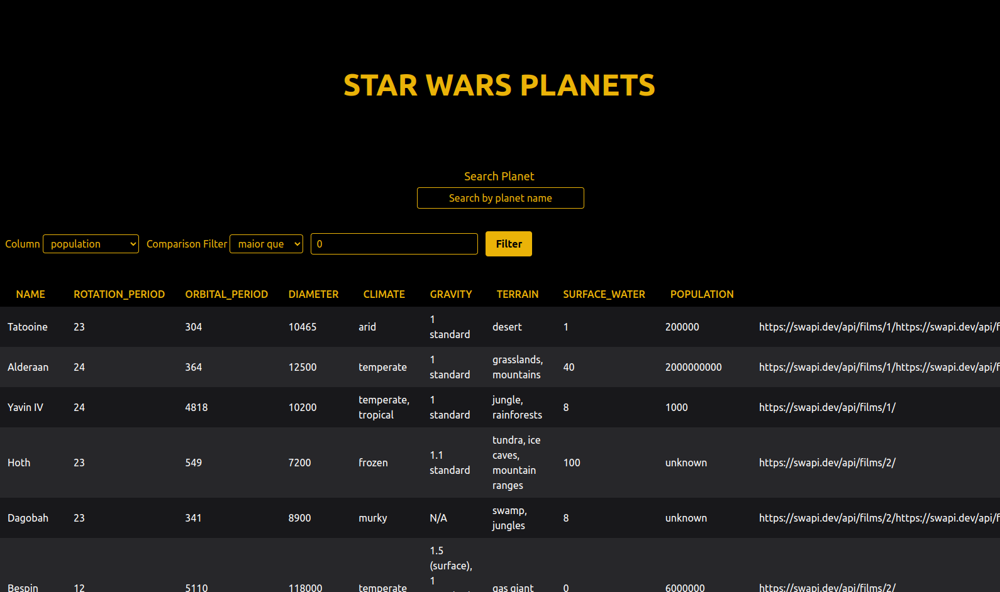

<h1 align="center">Star Wars Planets Search</h1>

  

 

<h2>📽️ See the results</h2>

You can view the project through the link below:

<li><a target="_blank" rel="noopener"href="https://starwars.clintonbrito.com/">starwars.clintonbrito.com</a></li>

 
 

<h2>💡 The story behind</h2>

I developed a list with filters for planets from the Star Wars universe using Context API and Hooks to manage global states.

The main goals of this project were:

<ol>
  <li>To use React's Context API to manage state.</li>
  <li>To use the React Hook useState.</li>
  <li>To use the React Hook useContext.</li>
  <li>To use the React Hook useEffect.</li>
  <li>To write tests to ensure that my application has good test coverage.</li>
</ol>

 
 

<h2>🧪 Technologies</h2>

This project was developed using:

  
  
  
  
  
  
  
  
  
  
  

 
 

<h2>🚀 Getting started</h2>

Clone the project and access the folder:

<pre><code>git clone git@github.com:clintonbrito/starwars-planets-search.git
cd starwars-planets-search
</code></pre>

Run this command to create project's Docker container and install the dependencies:

<pre><code>docker compose up -d</code></pre>

Open your browser and access the application through the address below to view the interface locally:

<pre><code>http://localhost:8080</code></pre>

 
 

<h2>📝 License</h2>
This project is licensed under the MIT License. See the <a target="_blank" rel="noopener" href="https://github.com/clintonbrito/recipes-app/blob/5c4b1a74ab43a352c393def783f06080b7256088/LICENSE">LICENSE</a> file for details.

 
 
 

Developed with ❤️ by Clinton Brito.
